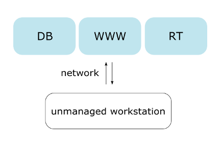
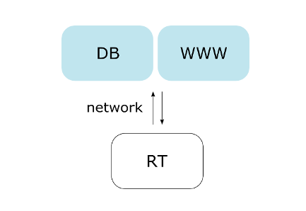
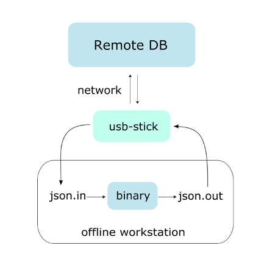

# Deployment

We offer several types of possible deployments which can rely
minimally or maximally on our remote servers. To make each as simple
as possible, we rely heavily on the docker container system. Below we
sketch all possible deployment solutions with _DB_ being the database,
_RT_ being the runtime environment, and _www_ is a web server.

## managed.all : full remotely-managed deployment

The remote (e.g. [http://whiplash.ethz.ch](http://whiplash.ethz.ch))
maintains the database, web-server and run-time environment. The user
communicates with [Whiplash](http://whiplash.ethz.ch) only through the
python module.

## unmanaged.all : fully unmanaged deployment

The user maintains the database, web-server and run-time
environment. All of these can be used customly depending upon the
unmanaged environment. Deployment si done seamlessly through the
Docker container system.

## unmanaged.scheduler : partial unmanaged deployment

This deployment includes the local run-time container with the
whiplash scheduler for local computational processing. Results are
then sent to the remote database server
(e.g. [http://whiplash.ethz.ch](http://whiplash.ethz.ch)).

## manual.scheduler : offline deployment

Solvers are ran manually and output is manually put into the database
using the [Whiplash](http://whiplash.ethz.ch) Python module. Note that
usage of this deployment should be reserved only for those behind an
extremely strict firewall.

