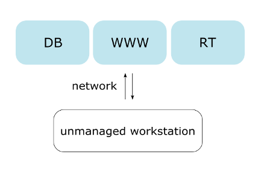
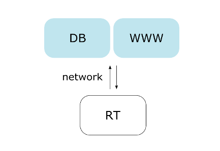

# Deployment

We offer several types of possible deployments which can rely minimally or maximally on our remote servers. To make each as simple as possible, we rely heavily on the docker container system. Below we sketch all possible deployment solutions with _DB_ being the database, _RT_ being the runtime environment (scheduler), and _www_ is a web server.

## managed.all : full remotely-managed deployment

No installation required for this deployment. The remote (e.g. whiplash.ethz.ch) maintains the actual database and the run-time environment.

The end user need only install the [WhiplashDB](http://whiplash.ethz.ch) python module to be able to commit models, properties, and executables to our remotely hosted framework.

## unmanaged.all : fully unmanaged deployment

This deployment includes the Mongo database container, the web-server container with the web-interface, and the run-time container with the whiplash scheduler for computational processing. All of these can be used customly depending upon the unmanaged environment.

With the __unmanaged.all__ deployment, the user has access to the full [WhiplashDB](http://whiplash.ethz.ch) solution, even though it is disconnected from the rest of the world.

## unmanaged.scheduler : partial unmanaged deployment

This deployment includes the local run-time container with the whiplash scheduler for the local computational processing - the results are then sent to the remote database server (e.g. whiplash.ethz.ch).

## manual.scheduler : offline deployment

This deployment contains the binaries for manual execution. Instead of the automatic execution (e.g. as in __unmanaged.all__) here the user is responsible to give the right input in json format. The output of the solver needs to then be converted back to json format and can then be manually put into the database afterward with the [WhiplashDB](http://whiplash.ethz.ch) Python module.

Note that usage of this deployment should be reserved only for those behind an extremely strict firewall since there will be considerably more overhead when serializing to and from ASCII json.
